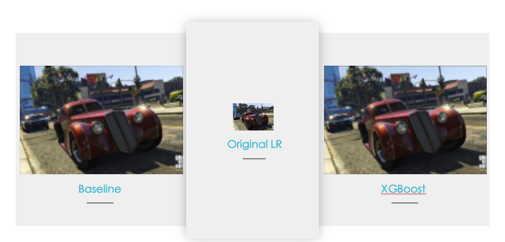

# Project: Can you unscramble a blurry image? 


### [Full Project Description](doc/project3_desc.md)

Term: Spring 2019

+ Team **Group 6**
+ Team members

	+ Jingwen Wang  (jw3667@columbia.edu)
	+ Weixuan Wu  (ww2493@columbia.edu)
	+ Ying Jin  (yj2453@columbia.edu)
	+ Yuqiao Li  (yl3965@columbia.edu)
	+ Ziyi Liao  (zl2739@columbia.edu)

+ Project summary: 

In this project, we created a classification engine for enhance the resolution of images. We used GBM model to conduct the Feature Extraction and to complete the Baseline Model. After tuning model parameter, the baseline model can reach accuracy at 99% level. In order to facilitate the computational efficiency, we develop an enhanced model by using XGboost method. This method greatly reduces the training and testing time and it reaches at 95% accuracy level. To further improve the image, we use `superResolution` technique to enlarge the image. As a result, images conducted by our model become smoother comparing to those are enlarged directly. 

- Baseline_0 (with `depth` = 3, 5, 7, 9, 11 and `n.trees=200`)

- Baseline_improved(with `depth` = 9,11, `shrinkage` = 0.1, 0.01, and 0.001,`n.trees=1000`)

- Extreme Gradient Boosting (with `depth`=6,7,8 and `eta`=0.5,0.6,0.7,0.8 and 0.9)


Our team also explore other methods in order to improve the training process. We tested SVM and Random Forest on small samples. These two methods cost relatively long time even for small smaples. We are still looking for solutions on applying these two methods on large training data set.

- SVM with RBF kernel (with `cost` = 0.1,1,10,50 and `gamma` = 0.01,0.1,1,10)

- Random Forest


	
**Contribution statement**: ([default](doc/a_note_on_contributions.md)) All team members contributed equally in all stages of this project. All team members approve our work presented in this GitHub repository including this contributions statement. 

- Jingwen Wang(jw3667): Worked on Baseline and Baseline_improved model; wrote the `superResolution` function; collaborated with Ziyi Liao, completed the `main.Rmd`; helped with writing `ReadMe` files.

- Yuqiao Li(yl3965): Worked on SVM model with RBF kernel; wrote `train_svm.Rmd` and `cross_validation_svm.Rmd`; tested the model on a small sample set. Wrote training result of small samples in `notes_svm.Rmd`. Helped with `ReadMe`.

- Ying Jin(yj2453): Worked on feature extraction; wrote `feature.R`. Prepare the presentation and slides; helped with `ReadMe`.

- Ziyi Liao(zl2739): Worked on Extreme Gradient Boosting(`XGBoost model`); collaborated with Jingwen Wang, completed the `main.Rmd`; prepare the presentation and slides. Helped with `ReadMe`.

Following [suggestions](http://nicercode.github.io/blog/2013-04-05-projects/) by [RICH FITZJOHN](http://nicercode.github.io/about/#Team) (@richfitz). This folder is organized as follows.

```
proj/
├── lib/
├── data/
├── doc/
├── figs/
└── output/
```

Please see each subfolder for a README file.
